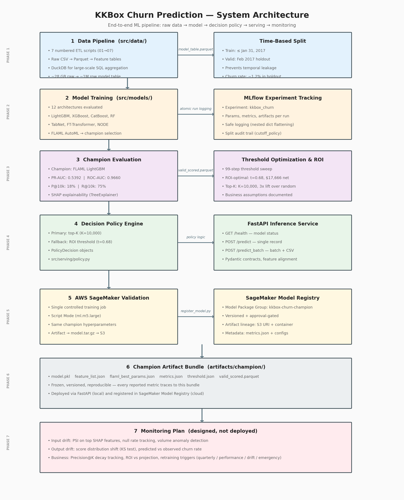

# AI Customer Retention & Decision Intelligence Platform


> End-to-end ML platform built on **~31 GB of real KKBox subscription data** — from raw logs to a production-grade decision policy. Predicts subscriber churn, optimizes intervention targeting, and simulates measurable business ROI.

This project goes beyond model accuracy. It demonstrates full-stack ML system design: scalable feature engineering, experiment governance, two-policy decision engine, and ROI-aligned threshold optimization — mirroring real MLE + MLOps + AI Product workflows.

---

## Results at a Glance

| Metric | Value | Lift |
|---|---:|---:|
| ROC-AUC (time-based holdout) | **0.9660** | **1.9x** vs random (0.50) |
| PR-AUC | **0.5392** | **43.5x** vs base rate (1.24% holdout) |
| Precision @ top-10k contacts | **18.0%** | **3x** vs overall churn rate |
| Recall @ top-10k contacts | **75.0%** | — |
| ROI-optimal policy net ROI | **$17,666** (1,478 users targeted) | — |
| Outreach policy net savings | **~$12,200** (10,000 users targeted) | — |

### Scaling: 31 GB to Production

The full ~31 GB KKBox dataset is processed end-to-end — not sampled, not approximated. Every scaling decision is documented with trade-offs and a web-scale migration path.

| Stage | Size | Tool | Why |
|---|---:|---|---|
| Raw CSVs | 31 GB | DuckDB streaming | pandas would OOM on 29 GB `user_logs.csv` |
| Parquet (ZSTD) | ~10 GB | DuckDB + column pruning | 3.4x compression; read only the columns you need |
| Aggregated features | ~500 MB | DuckDB 2-stage SQL | 13x reduction via daily pre-aggregation |
| ML-ready table | 118 MB | pandas joins | Small enough post-agg; pandas ecosystem wins |
| Champion model training | ~3 min | LightGBM + FLAML | Best PR-AUC across 12 models, 8x faster than deep learning |

> **Deep dive:** [`notebooks/08_scaling_prototype.ipynb`](notebooks/08_scaling_prototype.ipynb) — full trade-off analysis, DuckDB vs Spark rationale, and architecture blueprint for scaling to billions of rows.

---

## Table of Contents

1. [Problem & Business Goal](#1-problem--business-goal)
2. [Data & Split Strategy](#2-data--split-strategy)
3. [Model Benchmarking Results](#3-model-benchmarking-results)
4. [Champion Model & Why It Won](#4-champion-model--why-it-won)
5. [Decision Policy & ROI Simulation](#5-decision-policy--roi-simulation)
6. [Explainability & Product Insights](#6-explainability--product-insights)
7. [Serving: FastAPI Inference API](#7-serving-fastapi-inference-api)
8. [Experiment Tracking: MLflow](#8-experiment-tracking-mlflow)
9. [Cloud Validation: AWS SageMaker](#9-cloud-validation-aws-sagemaker)
10. [Scaling: Prototype to Production](#10-scaling-prototype-to-production)
11. [Monitoring Plan](#11-monitoring-plan)
12. [Tech Stack](#12-tech-stack)
13. [Repository Structure](#13-repository-structure)
14. [Quick Start](#14-quick-start)
15. [Project Status & Next Steps](#15-project-status--next-steps)
16. [What This Demonstrates](#16-what-this-demonstrates)

---

## 1. Problem & Business Goal

Every subscription business faces the same three questions:

| Question | This System's Answer |
|---|---|
| **Who is likely to churn?** | Ranked churn probability score for every subscriber |
| **Who should we target, given budget constraints?** | Hybrid policy: ops-driven top-K or ROI-optimal threshold |
| **What is the expected financial impact?** | Simulated net ROI under configurable cost assumptions |

**Core design principle:** *Model probability → Decision policy → Financial outcome.*

Traditional ML projects optimize ROC-AUC. This system optimizes **business ROI**.

---

## 2. Data & Split Strategy

**Source:** [KKBox Churn Prediction Challenge (Kaggle)](https://www.kaggle.com/competitions/kkbox-churn-prediction-challenge)

### 2.1 Dataset Overview

| Property | Value |
|---|---:|
| Raw size | ~31 GB |
| Processed model table | ~1M+ rows |
| Validation set | 193,205 rows |
| Churn rate (full dataset) | ~6% |
| Churn rate (time-based valid) | 1.2% |
| Time range | Jan 2015 – Feb 2017 |
| Holdout window | Feb 2017 (chronological) |

Large raw files are excluded from Git. The scored validation set and all champion artifacts are committed for reproducibility.

### 2.2 Why Time-Based Split

The champion evaluation uses a **chronological holdout** — train on everything up to Jan 31 2017, validate on Feb 2017. This simulates production: the model trains on historical data and predicts a future month it has never seen.

| | Random Split (XGBoost) | Time-Based Holdout (Champion) | Champion Lift |
|---|---:|---:|---:|
| ROC-AUC | 0.9875 | **0.9660** | **1.9x** vs random (0.50) |
| PR-AUC | 0.8771 | **0.5392** | **43.5x** vs base rate (1.24%) |

Lower time-based numbers are more honest — random splits leak temporal patterns and inflate all metrics. The ~6% overall churn rate drops to ~1.2% in the Feb 2017 holdout, which is expected with time-based splits and exactly what makes evaluation realistic.

### 2.3 Data Pipeline

Eight numbered, independently runnable scripts — no notebook dependencies:

| Script | Purpose |
|---|---|
| `01_convert_to_parquet.py` | Convert raw CSVs to columnar Parquet for fast I/O |
| `02_build_spine.py` | Create user-month observation spine (label join anchor) |
| `03_aggregate_transactions.py` | Transaction-level behavioral rollups per user |
| `04_aggregate_user_logs.py` | Activity log aggregations (listening behavior, etc.) |
| `05_build_model_table.py` | Join all feature tables into the ML-ready model table |
| `06_create_sample_data.py` | Lightweight extracts for dev / CI testing |
| `07_create_derived_tables.py` | Derived feature tables (recency, tenure, frequency) |
| `08_data_subset_for_sagemaker.py` | Create cost-controlled subset for SageMaker training |

**Key engineering decisions:**
- Strict chronological ordering prevents future-signal leakage
- Memory-aware processing for >31 GB raw files
- DuckDB used for large-scale in-process SQL aggregation
- All transformations are scriptable and reproducible

### 2.4 System Architecture



*Regenerate: `python scripts/generate_architecture_diagram.py`*

---

## 3. Model Benchmarking Results

12 model architectures evaluated — from baselines through deep learning and AutoML. Full details in [`leaderboard.md`](leaderboard.md).

Sorted by PR-AUC — the primary metric under class imbalance:

| # | Model | PR-AUC | PR-AUC Lift | ROC-AUC | F1 | Train Time | Notes |
|---:|---|---:|---:|---:|---:|---:|---|
| 1 | LightGBM | 0.8887 | **14.3x** | 0.9894 | 0.7845 | ~3 min | Baseline config, scale_pos_weight |
| 2 | XGBoost | 0.8771 | **14.1x** | 0.9875 | — | ~2 min | Baseline XGBoost |
| 3 | CatBoost | 0.8737 | **14.1x** | 0.9865 | 0.7282 | ~3.7 min | GPU-accelerated, early stop |
| 4 | FT-Transformer | 0.8214 | **13.2x** | 0.9824 | 0.6825 | ~23 min | 4-layer transformer, AMP, GPU |
| 5 | Random Forest | 0.7935 | **12.8x** | 0.9782 | 0.5798 | ~5 min | One-hot, balanced_subsample |
| 6 | NODE | 0.7719 | **12.4x** | 0.9737 | 0.5334 | ~11 min | 128 oblivious trees, GPU |
| 7 | TabNet | 0.5233 | **8.4x** | 0.9085 | 0.3998 | ~32 min | 5 failed runs before convergence |

> Leaderboard metrics use random splits for comparison speed. **Champion evaluation uses the time-based holdout** — the only number that matters for production.

### 3.1 Class Imbalance Strategy

- Class weighting at training time (`scale_pos_weight`)
- PR-AUC as the primary evaluation metric (not ROC-AUC, not accuracy)
- Precision@K for business-facing evaluation
- Full 99-step threshold sweep to find the ROI-aligned decision boundary

### 3.2 Why PR-AUC Over ROC-AUC

ROC-AUC can appear high (~0.96+) even when the model performs poorly on the minority class, because it credits correct majority-class predictions equally. With a 1.2% churn rate in the time-based holdout, ROC-AUC overstates discriminative power.

PR-AUC directly measures how well the model concentrates true churners at the top of the ranked list — which is exactly what the business needs for targeted intervention. A model with 0.96 ROC-AUC but 0.40 PR-AUC is a model that looks great on paper but wastes outreach budget.

---

## 4. Champion Model & Why It Won

**FLAML AutoML — LightGBM** | MLflow experiment: `kkbox_churn` | Run: `champion_lgbm_time_holdout`

### 4.1 Champion Metrics (time-based holdout)

| Metric | Value | Lift |
|---|---:|---:|
| ROC-AUC | 0.9660 | **1.9x** vs random (0.50) |
| PR-AUC | **0.5392** | **43.5x** vs base rate (1.24%) |
| F1 @ threshold 0.5 | 0.3678 | — |
| Precision @ top-5k | 26.9% | **21.7x** vs base rate |
| Precision @ top-10k | **18.0%** | **14.5x** vs base rate |
| Precision @ top-20k | 10.9% | **8.8x** vs base rate |
| Recall @ top-5k | 56.0% | — |
| Recall @ top-10k | **75.0%** | — |
| Recall @ top-20k | 90.7% | — |

**Churn concentration lift:** Top-10k churn rate 18% vs. base rate ~6% — roughly **3x concentration** of churners over random selection. On the time-based holdout (1.24% churn), PR-AUC lift is **43.5x** over random — the model ranks churners 43x better than chance.

### 4.2 Why This Model Won

1. **Highest PR-AUC on the time-based holdout (0.5392)** — PR-AUC directly measures ranking quality under severe class imbalance (1.24% validation churn rate)
2. **Architecture dominance confirmed twice** — LightGBM ranked #1 in the random-split leaderboard (0.8887 PR-AUC), and FLAML's AutoML search independently converged on LightGBM as the best estimator
3. **Broader hyperparameter search** — FLAML explored configurations manual tuning missed (e.g., `num_leaves=1212` vs. manual `64`, `reg_alpha=0.56`), producing better generalization to the harder time-based split
4. **Training efficiency** — LightGBM trains in ~3 minutes vs. 23-32 minutes for deep learning alternatives (FT-Transformer, TabNet) that scored worse on every metric

Artifacts frozen in `artifacts/champion/` — see [`artifacts/champion/notes.md`](artifacts/champion/notes.md) for the reproducibility checklist.

---

## 5. Decision Policy & ROI Simulation

### 5.1 Decision Policy Engine

Located in `src/serving/policy.py`. The production policy is **hybrid**:

```json
{
  "primary_policy":   { "type": "top_k",    "k": 10000 },
  "secondary_policy": { "type": "threshold", "threshold": 0.68 }
}
```

#### Policy 1 — Ops-Friendly Top-K *(primary)*

Target the **top-10,000 highest-risk subscribers** by predicted probability, each scoring cycle.

| Metric | Value | Lift |
|---|---:|---:|
| Contacts per cycle | 10,000 (fixed) | — |
| Precision | 18.0% | **3x** vs base rate |
| Recall | 75.0% | — |
| Equiv. threshold | ~0.21 | — |

**Why top-K is preferred operationally:**
- Contact volume is predictable and budget-bounded every month
- No threshold recalibration needed as score distributions shift over time
- Highest-risk users are always selected
- Simple governance: rank and send

#### Policy 2 — ROI-Optimal Threshold *(fallback)*

Used when operational capacity is not the binding constraint — e.g., automated low-cost interventions.

| Metric | Value |
|---|---:|
| Threshold | 0.68 |
| Contacts | 1,478 |
| Precision | 70.6% |
| Recall | 43.5% |
| Estimated net ROI | **$17,666** |

`PolicyDecision` objects include: churn probability, action (`target` / `no_target`), policy used, threshold, rank, and metadata.

### 5.2 ROI Simulation

#### Framework

```
Net ROI = (TP x save_rate x churn_cost) - (N_targeted x intervention_cost)

Where:
  TP                = true positives (targeted users who would have churned)
  save_rate         = fraction of targeted churners successfully retained
  churn_cost        = revenue lost per unretained churner
  intervention_cost = cost per outreach contact
```

#### Scenario Comparison

| Scenario | Cost/contact | Save rate | Value/save | Net result |
|---|---:|---:|---:|---:|
| **Outreach** (email/SMS/nudge) | $0.50 | 12% | $80 | **~$12,200** |
| **Incentive** (discount/offer) | $10.00 | 20% | $60 | Cost-sensitive |
| **ROI-optimal threshold** | $5.00 | 20% | $120 | **$17,666** |

Full scenario documentation: [`reports/business_assumptions.md`](reports/business_assumptions.md)

#### Threshold Sweep Outputs

`src/evaluation/threshold_optimization.py` sweeps 99 thresholds and produces:

| Output | Description |
|---|---|
| `reports/threshold_sweep.csv` | Per-threshold: precision, recall, F1, Precision@K, ROI, n_targeted |
| `artifacts/champion/threshold.json` | Selected policy parameters (both policies) |
| `reports/threshold_vs_precision_recall.png` | Precision / Recall / F1 vs. threshold |
| `reports/threshold_vs_roi.png` | Expected ROI vs. threshold with annotated peak |

---

## 6. Explainability & Product Insights

To move beyond black-box prediction, the champion LightGBM model is analyzed with **SHAP** (SHapley Additive exPlanations) — making predictions auditable for engineers and actionable for product teams.

### 6.1 SHAP Analysis

SHAP decomposes each individual prediction into additive feature contributions:

```
churn_probability  =  base_rate
                    + Σ (per-feature SHAP contributions)
```

Every feature either increases or decreases a user's churn risk relative to the population average — making each score fully explainable.

**What SHAP enables:**
- Identify the strongest global churn drivers across the model
- Separate risk-increasing signals from protective ones
- Detect when the model is learning noise vs. real behavioral patterns
- Segment users into actionable behavioral cohorts

**Outputs** — computed on a 20,000-row validation sample via `shap.TreeExplainer`:

```bash
python -m src.evaluation.shap_analysis
```

| Output | Description |
|---|---|
| `reports/shap_summary.png` | Beeswarm plot — feature importance + direction across all users |
| `reports/top_features.csv` | Ranked feature list with mean absolute SHAP values |

### 6.2 Top Churn Drivers

| Rank | Feature | Mean \|SHAP\| | Business Signal |
|---:|---|---:|---|
| 1 | `auto_renew_rate` | 0.593 | Auto-renewal opt-in rate — the single strongest churn predictor; users not opting in are signaling exit intent |
| 2 | `cancel_rate` | 0.499 | Historical cancellation ratio — past behavior is a very strong fingerprint for future churn |
| 3 | `plan_list_price_max` | 0.329 | Peak plan price seen — captures price sensitivity and premium-tier exposure |
| 4 | `log_last_date` | 0.281 | Recency of last activity — disengagement precursor; a leading indicator before cancellation |
| 5 | `membership_expire_date_max` | 0.247 | Subscription horizon — proximity to expiry concentrates churn risk |

### 6.3 Model-Derived Risk Signals

SHAP confirms that the model has learned interpretable, causally-plausible churn signals — not spurious correlations:

| Risk Signal | Key Feature | Business Interpretation |
|---|---|---|
| Auto-renewal opt-out pattern | `auto_renew_rate` | Strongest signal — low auto-renewal rate directly reflects disengagement or intent to cancel |
| Historical cancellation behavior | `cancel_rate` | Past cancellations strongly predict future churn; the model learned this behavioral fingerprint |
| Declining recent activity | `log_last_date` | Recency of last activity is a leading indicator — disengagement precedes cancellation |
| Imminent subscription expiry | `membership_expire_date_max` | Expiry proximity concentrates churn risk — intervention window is narrow |
| Short tenure | `txn_tenure_days_approx` | Early lifecycle churn — product fit or onboarding issue |

### 6.4 Translating Risk Into Action

Model scores and SHAP cohort signals together enable targeted retention strategies:

| Intervention | Channel | When to Use |
|---|---|---|
| Proactive outreach | Email / SMS / in-app push | Default for all top-K users |
| Renewal reminder | Email / push notification | Users within 7–14 days of expiry |
| Payment resolution | Support + email | Users with recent payment failures |
| Friction reduction | UX / product flow | Users dropping off at renewal step |
| Human-assisted retention | Support team | High-LTV users in top decile of risk |

### 6.5 Experimental Validation *(AI Product Lens)*

Churn models predict *who will churn* — not *who will respond to intervention*. Without a control group, measured ROI conflates natural churn with model-driven saves. The correct validation approach:

1. Score all subscribers monthly
2. Select the top-K highest-risk users
3. Randomly split into: **50% Treatment** (retention campaign) / **50% Control** (no contact)
4. Measure churn rate difference between groups after 30 days

This isolates true incremental lift:

```
True incremental ROI  =  (churn_rate_control − churn_rate_treatment)
                       × N_treatment
                       × LTV
                       − intervention_cost
```

This is the correct metric — it separates predictive correlation from **causal retention uplift**.

---

## 7. Serving: FastAPI Inference API

Production-ready REST API at `src/serving/api.py` — wraps the champion model and exposes both decision policies over HTTP. Built with FastAPI and Pydantic; all artifacts are loaded at startup from `artifacts/champion/`.

```bash
uvicorn src.serving.api:app --reload
# Swagger UI: http://localhost:8000/docs
```

### 7.1 Endpoints

| Endpoint | Method | Description |
|---|---|---|
| `/health` | GET | Model load status, artifact paths, feature count, default threshold |
| `/predict` | POST | Single-record churn probability + threshold action label |
| `/predict_batch` | POST | Batch scoring via JSON list or CSV file upload — threshold or top-K policy |

### 7.2 Two Serving Policies

**Threshold policy** (single record or batch):
```json
POST /predict
{ "record": { ...feature dict... }, "policy": "threshold", "threshold": 0.68 }
```

**Top-K policy** (batch only — ranking requires population context):
```json
POST /predict_batch
{ "records": [...], "policy": "top_k", "k": 10000 }
```

Returns per-record: `churn_probability`, `churn_label`, `rank` (top-K only), `policy_used`, `threshold_used`.

**CSV batch upload** is also supported via multipart form upload to `/predict_batch` — enabling analyst-driven batch scoring without a pipeline dependency.

### 7.3 Design Notes

- Pydantic input/output models enforce contract at the API boundary — `PredictRequest`, `BatchPredictRequest`, `BatchPredictResponse`
- Feature alignment at inference time: missing columns filled with `NaN`, extra columns silently dropped — robust to schema drift
- Equivalent threshold for the configured top-K is surfaced in the response when it matches `threshold.json`, giving every top-K batch run a threshold anchor for auditability

---

## 8. Experiment Tracking: MLflow

All training runs are tracked in the **`kkbox_churn`** MLflow experiment — params, metrics, and artifacts logged atomically in every run, enabling full reproducibility and side-by-side model comparison across all 12 experiments.

A custom wrapper at `src/utils/mlflow_utils.py` provides safe, robust logging: nested dict flattening, non-numeric filtering, graceful missing-file handling, and standardized metric naming — ensuring consistent, queryable data across every run.

### 8.1 What Gets Logged Per Run

**Parameters** — logged via `log_params_flat`, which auto-flattens nested dicts using `.` separator:

| Parameter | Champion Value | Purpose |
|---|---|---|
| `cutoff_policy` | `quantile_0.8` | Records the split that *actually ran* — not just the intended config |
| `cutoff_date` | `2016-...` | Exact data boundary applied to this run |
| `feature_version` | `model_table_v1` | Ties each run to a specific data pipeline output |
| `lgbm_params.num_leaves` | `1212` | Nested hyperparams flattened — individually queryable in the UI |
| `lgbm_params.learning_rate` | `0.0358` | All FLAML params captured without manual unpacking |
| `top_k_values` | `[5000, 10000, 20000]` | Business evaluation targets baked into run metadata |

**Metrics** — logged via `log_metrics_safe`, which filters non-numeric values and prevents crashes:

| Metric | Champion Run |
|---|---:|
| `roc_auc` | 0.9660 |
| `pr_auc` | **0.5392** |
| `f1_at_0_5` | 0.3678 |
| `precision_at_5000` | 0.2690 |
| `precision_at_10000` | 0.1801 |
| `precision_at_20000` | 0.1090 |
| `recall_at_5000` | 0.5600 |
| `recall_at_10000` | 0.7498 |
| `recall_at_20000` | 0.9072 |

**Artifacts** — all logged in a single atomic run via `log_artifacts_safe` (skips missing files gracefully):

| Artifact | Description |
|---|---|
| `model.pkl` | Trained champion model |
| `feature_list.json` | Exact feature columns and order used at train/score time |
| `flaml_best_params.json` | Full FLAML hyperparameter configuration |
| `metrics.json` | Complete evaluation summary |
| `valid_scored.parquet` | Scored validation set — the data behind every reported metric |
| `threshold_sweep.csv` | 99-threshold precision, recall, ROI, and Precision@K sweep |
| `threshold.json` | Selected policy parameters (both policies) |
| `threshold_vs_precision_recall.png` | Precision / Recall / F1 vs. threshold plot |
| `threshold_vs_roi.png` | Expected ROI vs. threshold with annotated peak |

### 8.2 Experiment Structure

```
MLflow Experiment: kkbox_churn
  |
  +-- Run: champion_lgbm_time_holdout
  |     Tags:   stage=champion, model=lgbm
  |     Params: cutoff_policy, feature_version, lgbm_params.*, top_k_values
  |     Metrics: roc_auc, pr_auc, precision_at_*, recall_at_*
  |     Artifacts: model + eval data + all downstream reports
  |
  +-- [all 12 model runs comparable in the same experiment view]
```

### 8.3 View in the MLflow UI

```bash
mlflow ui
# Open: http://localhost:5000
```

Compare all 12 model runs side-by-side, filter by metric, inspect per-run artifact lineage, and trace every reported number back to the exact data and code that produced it.

### 8.4 Design Decisions Worth Noting

- **Atomic artifact bundles** — model, `valid_scored.parquet`, and all downstream reports are logged in the same run. Every metric is permanently traceable to the data that generated it — no orphaned checkpoints or mismatched eval files
- **Split method audit trail** — `cutoff_policy` records `quantile_0.8` when the fixed-date fallback triggered, not the intended `fixed_date` config. In production, a model registered with the wrong split metadata can cause silent evaluation-training mismatch bugs months later
- **Graceful phased rollout** — `log_artifacts_safe` skips files that don't exist yet (e.g., SHAP plots), so the training run succeeds and logs everything available without failing on planned-but-not-yet-built outputs
- **Standardized metric naming** — `build_eval_metrics_dict` enforces consistent key names (`precision_at_10000`, not `p@10k`) across all experiments, making cross-run queries reliable

---

## 9. Cloud Validation: AWS SageMaker

To demonstrate that the local champion pipeline translates to managed cloud infrastructure, a single controlled SageMaker training job was executed using the same LightGBM configuration and hyperparameters as the local champion.

Full documentation: [`cloud/sagemaker/README.md`](cloud/sagemaker/README.md)

### 9.1 Purpose

This phase validates **cloud workflow capability** — not model improvement. It proves end-to-end SageMaker literacy: S3 data ingestion, managed training, artifact packaging, and Model Registry integration.

Only one job was run because the purpose was to demonstrate the workflow, not repeat tuning in the cloud. SageMaker bills per-second of instance time — running 12+ experiments on `ml.m5.large` would add cost with no modeling benefit.

### 9.2 SageMaker Job Details

| Property | Value |
|---|---|
| Job type | SageMaker Training Job (Script Mode) |
| Training image | `sklearn 1.2-1` (pre-built SageMaker container) |
| Instance type | `ml.m5.large` |
| Entry script | `cloud/sagemaker/train.py` |
| Input channel | S3 parquet via `train` channel |
| Hyperparameters | Identical to local champion (FLAML-tuned LightGBM) |
| Model artifact | `s3://amey-kkbox-sagemaker-us-east-1/kkbox-churn/training/artifacts/kkbox-churn-champion-20260310142800/output/model.tar.gz` |

### 9.3 Local Champion vs. SageMaker Run

| Metric | Local Champion | SageMaker Run |
|---|---:|---:|
| ROC-AUC | **0.9660** | 0.9484 |
| PR-AUC | **0.5392** | 0.4707 |
| F1 | 0.3678 | **0.4658** |

- **ROC-AUC / PR-AUC:** Local model ranks churners better. Differences stem from data subset fraction (cost control) and quantile fallback split shifting the validation distribution
- **F1 reversal:** Local F1 uses a fixed 0.5 threshold. F1 is sensitive to the score distribution near the cutoff. ROC-AUC and PR-AUC are threshold-invariant and remain the more reliable cross-environment metrics

### 9.4 Workflow Architecture

```
Local machine                          AWS
─────────────                          ───
launch_training_job.py  ──────────►  SageMaker Training Job
                                       ├── reads parquet from S3 (train channel)
                                       ├── runs train.py (LightGBM champion config)
                                       ├── writes model.pkl, metrics.json, valid_scored.parquet
                                       └── packages /opt/ml/model/ → model.tar.gz → S3

register_model.py  ───────────────►  SageMaker Model Registry
                                       └── creates versioned model package (Approved)
```

### 9.5 What This Phase Demonstrates

- S3-based input/output data workflows
- SageMaker Script Mode with custom `train.py` and `requirements.txt`
- Chronological train/validation split preserved in a managed environment
- Artifact management: model, metrics, scored validation set auto-packaged to S3
- Model Registry: versioned, approval-gated model package creation
- Cost-controlled execution: single job, single instance, optional subset fraction

---

## 10. Scaling: Prototype to Production

The complete ~31 GB KKBox dataset was processed end-to-end — not sampled, not approximated. This section documents the scaling decisions, trade-offs, and the architecture blueprint for web-scale deployment.

Full walkthrough with executable code: [`notebooks/08_scaling_prototype.ipynb`](notebooks/08_scaling_prototype.ipynb)

### 10.1 The Data Funnel

| Stage | Size | Tool | Why This Tool |
|---|---:|---|---|
| Raw CSVs | 31 GB | DuckDB streaming | pandas would OOM on 29 GB `user_logs.csv` |
| Parquet (compressed) | ~10 GB | DuckDB + ZSTD | 3.4x compression; column pruning for fast reads |
| Aggregated features | ~500 MB | DuckDB 2-stage SQL | 13x intermediate reduction via daily pre-agg |
| ML-ready model table | 118 MB | pandas joins | Small enough post-aggregation; pandas ecosystem wins |
| Trained model | ~3 min | LightGBM + FLAML | Fastest and best-performing across 12 architectures |

### 10.2 Key Scaling Decisions & Trade-offs

| Decision | Chose | Over | Why |
|---|---|---|---|
| **DuckDB over Spark** | Zero-config, single-process SQL | Distributed cluster | Spark requires cluster overhead; DuckDB saturates local I/O first |
| **File-backed DuckDB** | Spill-to-disk safety | In-memory mode | In-memory DuckDB crashed on Windows with 8.7 GB Parquet |
| **2-stage aggregation** | Daily pre-agg → user rollup | Single GROUP BY | Single-stage on 400M rows exceeded memory budget |
| **Parquet + ZSTD** | Better compression, column pruning | CSV / Snappy | Output stored long-term; read speed is what matters |
| **LightGBM over deep learning** | 3 min train, best PR-AUC | FT-Transformer (23 min) | Neural nets scored worse on every metric and cost 8x more time |

### 10.3 Web-Scale Architecture Blueprint

Every component has a documented migration path from single-machine to distributed:

```
CURRENT (Single Machine)              WEB-SCALE (Distributed)
════════════════════════              ══════════════════════════

Storage:
  Parquet on local disk       →→→       Delta Lake / Iceberg on S3
  DuckDB file-backed          →→→       BigQuery / Redshift

Compute:
  DuckDB SQL + 2-stage agg    →→→       Spark SQL (same pattern, distributed)
  pandas joins (post-agg)     →→→       Spark DataFrame joins

Training:
  LightGBM (local)            →→→       LightGBM distributed (Spark/Ray)
  FLAML AutoML                →→→       SageMaker HP Tuning Jobs

Serving:
  FastAPI (single instance)   →→→       SageMaker Endpoints + API Gateway
  Batch scoring (local)       →→→       SageMaker Batch Transform

Orchestration:
  Manual scripts (01→08)      →→→       Airflow / Step Functions DAGs
```

### 10.4 Scaling Projections

| Scenario | Users | Raw Data | Model Table | Compute Engine |
|---|---:|---:|---:|---|
| **Current (KKBox)** | 1M | 31 GB | 118 MB | DuckDB (local) |
| **10x** | 10M | 310 GB | 1.2 GB | DuckDB (local) |
| **100x** | 100M | 3 TB | 12 GB | Spark SQL (cluster) |
| **1000x (web-scale)** | 1B | 31 TB | 115 GB | BigQuery / Spark |

The 2-stage aggregation pattern, Parquet columnar format, and LightGBM's histogram-based training all scale linearly — the architecture doesn't require redesign, only swapping the execution engine.

---

## 11. Monitoring Plan

This section describes the monitoring strategy that would apply once the model serves live predictions. No live monitoring is deployed (there is no production endpoint), but the architecture is designed to support it.

### 11.1 What to Monitor

| Layer | Signal | Detection Method | Action |
|---|---|---|---|
| **Input data** | Feature distribution drift | PSI (Population Stability Index) on each feature, computed monthly | Alert if PSI > 0.20 on any top-10 SHAP feature |
| **Input data** | Missing value rate spike | Track null fraction per feature per scoring batch | Alert if null rate exceeds 2x historical baseline |
| **Input data** | Volume anomaly | Row count per scoring cycle | Alert if batch size deviates >20% from expected |
| **Model output** | Score distribution shift | Compare monthly prediction histogram vs. training baseline (KS test or PSI) | Alert if distribution shifts significantly — may indicate concept drift |
| **Model output** | Churn rate vs. predicted rate | Compare predicted positive rate to observed churn rate (with label delay) | Persistent gap suggests calibration decay |
| **Business** | Precision@K decay | Track actual churn rate in top-K targeted users once labels arrive (~30-day delay) | Retrain if Precision@K drops below 1.5x base rate |
| **Business** | ROI tracking | Compare simulated ROI vs. actual campaign outcomes | Adjust cost assumptions or retrain if ROI underperforms projection by >30% |
| **Infrastructure** | API latency / error rate | FastAPI middleware logging (p50, p95, p99 latency) | Scale or investigate if p95 > 500ms or error rate > 1% |

### 11.2 Label Delay Problem

Churn labels arrive with a ~30-day delay (a user churns at the end of their billing cycle). This means model performance metrics lag by one month. During that window, **input drift signals are the only early warning**.

Monitoring priority:
1. **Immediate** (every batch): input schema validation, null rates, volume, prediction distribution
2. **Delayed** (monthly, after labels arrive): Precision@K, recall, PR-AUC on the latest scored cohort
3. **Periodic** (quarterly): full retrain evaluation against the latest 3-month window

### 11.3 Retraining Triggers

| Trigger | Condition | Response |
|---|---|---|
| Scheduled | Quarterly (or after major product changes) | Retrain on latest 12-month window, evaluate on most recent month |
| Performance-based | Precision@K drops below 1.5x base rate for 2 consecutive months | Retrain with updated features and re-evaluate |
| Drift-based | PSI > 0.25 on 3+ top-10 features in a single month | Investigate root cause, retrain if feature semantics changed |
| Emergency | Model serving errors or complete prediction failure | Rollback to previous approved Model Registry version |

---

## 12. Tech Stack

| Category | Libraries |
|---|---|
| **Data & compute** | NumPy, Pandas, PyArrow, DuckDB |
| **ML — gradient boosting** | LightGBM, XGBoost, CatBoost |
| **ML — deep learning** | PyTorch, pytorch-tabnet (TabNet, FT-Transformer, NODE) |
| **AutoML** | FLAML |
| **Experiment tracking** | MLflow |
| **Explainability** | SHAP |
| **Serving** | FastAPI, uvicorn |
| **Cloud / MLOps** | AWS SageMaker (Training Jobs, Model Registry), boto3, S3 |
| **Dashboard** | Streamlit *(planned)* |
| **Visualization** | Matplotlib, Seaborn |
| **Utilities** | scikit-learn, joblib, tqdm, fsspec |

---

## 13. Repository Structure

```
ai-customer-retention-mlops/
|
|-- cloud/
|   `-- sagemaker/                 # SageMaker cloud training validation
|       |-- train.py               # Training script (runs inside container)
|       |-- launch_training_job.py # Job submission (runs locally)
|       |-- register_model.py      # Model Registry registration
|       `-- requirements.txt       # Container runtime dependencies
|
|-- data/                           # Raw, processed, sample data  (large files gitignored)
|-- notebooks/
|   |-- 08_scaling_prototype.ipynb  # Step 8: Scaling the prototype to full dataset (31 GB)
|   |-- 01-04_*_eda.py             # Exploratory analysis scripts
|-- reports/                        # Business assumptions, threshold sweep CSV, plots
|-- scripts/
|   |-- generate_leaderboard.py
|   `-- generate_architecture_diagram.py
|-- docs/
|   |-- executive_summary.md         # AI PM narrative: problem, impact, rollout, A/B test
|   |-- architecture.png             # System architecture diagram
|   `-- KKBox Churn Prediction Capstone Project Proposal.pdf
|-- artifacts/
|   `-- champion/                   # Frozen model bundle
|       |-- model.pkl
|       |-- threshold.json          # Decision policy (ROI-optimal + ops top-K)
|       |-- deployment_policy.json  # Hybrid policy definition
|       |-- metrics.json
|       |-- feature_list.json
|       |-- flaml_best_params.json
|       |-- roi_policy.json
|       |-- valid_scored.parquet    # Scored validation set (msno, y_true, y_proba)
|       `-- notes.md
|
|-- src/
|   |-- data/                       # ETL pipeline  (01 --> 08 numbered scripts)
|   |-- models/                     # 01_baseline --> 12_automl_flaml + 13/14/15 champion scripts
|   |-- evaluation/
|   |   |-- threshold_optimization.py
|   |   `-- shap_analysis.py        # SHAP TreeExplainer -- beeswarm + feature ranking
|   |-- serving/
|   |   |-- api.py                  # FastAPI inference service  (GET /health, POST /predict, POST /predict_batch)
|   |   |-- policy.py               # PolicyDecision engine  (top-K + threshold)
|   |   |-- app_streamlit.py        # Streamlit executive dashboard
|   |   `-- test_policy.py
|   `-- utils/
|       |-- mlflow_utils.py          # Safe MLflow logging (nested flatten, artifact handling)
|       `-- run_logger.py
|
|-- leaderboard.md
|-- requirements.txt
|-- requirements-dev.txt
|-- Dockerfile                        # Production container for FastAPI serving
|-- requirements-serve.txt            # Minimal serving dependencies
|-- render.yaml                       # Render.com deployment config
|-- LICENSE
`-- README.md
```

---

## 14. Quick Start

### 14.1 Install

```bash
pip install -r requirements.txt
```

### 14.2 Run the data pipeline

```bash
python src/data/01_convert_to_parquet.py
python src/data/02_build_spine.py
python src/data/03_aggregate_transactions.py
python src/data/04_aggregate_user_logs.py
python src/data/05_build_model_table.py
```

### 14.3 Train the champion model (with MLflow tracking)

```bash
python -m src.models.13_train_champion_lgbm_mlflow
```

Logs params, metrics, and all artifacts to the `kkbox_churn` MLflow experiment automatically.

### 14.4 View experiments in MLflow UI

```bash
mlflow ui
# Open: http://localhost:5000
```

### 14.5 Score validation set

```bash
python src/models/14_score_valid_champion.py
```

### 14.6 Run threshold sweep & generate plots

```bash
python src/evaluation/threshold_optimization.py
```

### 14.7 Run SHAP explainability analysis

```bash
python -m src.evaluation.shap_analysis
# Outputs: reports/shap_summary.png, reports/top_features.csv
```

### 14.8 Launch the inference service

**Option A — Local development:**

```bash
uvicorn src.serving.api:app --reload
# Swagger UI: http://localhost:8000/docs
# Endpoints: GET /health  |  POST /predict  |  POST /predict_batch
```

**Option B — Docker (production):**

```bash
docker compose up --build
# API:       http://localhost:8000/docs   (Swagger UI)
# Dashboard: http://localhost:8501        (Streamlit)
# Health:    http://localhost:8000/health
```

**Option C — Docker (API only):**

```bash
docker build -t churn-api .
docker run -p 8000:8000 churn-api
```

### 14.9 Run tests

```bash
pytest src/serving/test_api.py -v
# 16 tests: health, single predict, batch CSV, edge cases
```

### 14.10 Generate leaderboard

```bash
python scripts/generate_leaderboard.py
```

### 14.11 Use the policy engine directly

```python
from src.serving.policy import apply_threshold, apply_topk_to_batch

# Single-user threshold policy
decision = apply_threshold(prob=0.82, threshold=0.68)
# PolicyDecision(action='target', policy_used='threshold', ...)

# Batch top-K policy
ranks = apply_topk_to_batch(probs=score_array, k=10_000)
```

---

## 15. Project Status & Next Steps

### 15.1 Current Status

| Component | Status |
|---|---|
| Data pipeline (ETL, feature engineering) | ✅ Complete |
| Model training — 12 experiments | ✅ Complete |
| MLflow tracking + leaderboard | ✅ Complete |
| Champion model selection | ✅ Complete |
| Threshold optimization & ROI sweep | ✅ Complete |
| Decision policy engine | ✅ Complete |
| FastAPI inference service | ✅ Complete |
| SHAP explainability layer | ✅ Complete |
| Cloud training validation (SageMaker) | ✅ Complete |
| Scaling analysis & production blueprint | ✅ Complete ([notebook](notebooks/08_scaling_prototype.ipynb)) |
| Structured API logging | ✅ Complete (request/response, latency, startup) |
| API test suite (pytest) | ✅ Complete (16 tests: health, predict, batch, edge cases) |
| Docker Compose (one-command startup) | ✅ Complete (`docker-compose.yml`) |
| Monitoring implementation | 📋 Designed (Section 11) |
| Streamlit executive dashboard | ✅ Complete (`src/serving/app_streamlit.py`) |
| Dockerfile + cloud deployment | ✅ Complete (`Dockerfile`, `render.yaml`, HEALTHCHECK) |
| End-to-end pipeline orchestrator | 📋 Planned |

### 15.2 Next Steps

| Priority | Item | Impact |
|---:|---|---|
| 1 | **Streamlit executive dashboard** — finalize interactive threshold / ROI scenario explorer for non-technical stakeholders | Bridges the gap between model output and business decision-making |
| 2 | **CI/CD pipeline hardening** — expand GitHub Actions workflow with automated testing and staging gates | Adds production-grade deployment automation |
| 3 | **Automated retraining pipeline** — scheduled retrain on latest data window with MLflow-gated promotion | Closes the loop from monitoring signals to model refresh |
| 4 | **A/B test simulation** — implement the treatment/control framework described in Section 6.5 to estimate causal uplift | Moves from predictive accuracy to true incremental business impact |

---

## 16. What This Demonstrates

### For Machine Learning Engineer Roles

- End-to-end ML pipeline: raw data through scored predictions, decision policy, and a live serving API
- Principled handling of severe class imbalance at million-row scale
- Time-based cross-validation that reflects production realities — and documents *why* random splits mislead
- AutoML + manual model comparison with a governed, reproducible leaderboard
- Threshold optimization tied directly to a business cost function, not ML metrics
- Dual-policy decision engine with documented trade-offs between coverage and efficiency
- Production REST API (FastAPI + Pydantic) exposing both policies with full request/response contracts
- SHAP explainability layer producing auditable feature contributions from a tree ensemble
- **Scaling narrative:** 31 GB processed end-to-end with documented trade-offs at every layer — storage (Parquet), compute (DuckDB), training (LightGBM), cloud (SageMaker) — plus a web-scale architecture blueprint for billion-row migration

### For MLOps / Data Engineering Roles

- Reproducible, script-driven data pipeline with clear stage separation — no notebook dependencies
- **Scaling deep-dive** ([notebook](notebooks/08_scaling_prototype.ipynb)): 31 GB → 118 MB data funnel with 2-stage aggregation, DuckDB streaming SQL, memory-bounded processing, and documented decision trade-offs at every stage
- Custom MLflow wrapper (`src/utils/mlflow_utils.py`) with nested param flattening, safe metric logging, and graceful artifact handling — not just a `mlflow.log_metric` call
- Atomic run logging: model + scored validation data + downstream reports in one run, making every metric permanently traceable
- Split method audit trail: `cutoff_policy` records what actually ran, not what was configured — production-grade reproducibility thinking
- SHAP explainability pipeline (`src/evaluation/shap_analysis.py`) producing beeswarm plots and ranked feature CSV — model auditing built in, not bolted on
- FastAPI serving layer with two policy modes, Pydantic contract enforcement, and CSV batch upload — separation of serving logic from model training
- AWS SageMaker Training Job with Script Mode — same champion config, managed infrastructure, S3 artifact packaging
- SageMaker Model Registry integration — versioned, approval-gated model packages
- Modular `src/` layout designed for CI/CD integration
- Numbered ETL scripts (01→08) for explicit dependency ordering
- DuckDB for large-scale in-process SQL aggregation on raw files

### For Business / Analytics / Product Roles

- ROI simulation framework connecting model Precision@K to net financial impact
- Two defensible policies with documented trade-offs: coverage vs. per-contact efficiency
- Budget-bounded top-K targeting for predictable monthly operational load
- Scenario modeling across intervention types: outreach vs. incentive offers
- Business assumptions documented separately — not baked silently into model training
- Monitoring plan with label-delay awareness and retraining triggers
- Executive dashboard for threshold and ROI scenario exploration *(planned)*

---

*Built on the [KKBox Churn Prediction](https://www.kaggle.com/competitions/kkbox-churn-prediction-challenge) dataset.*
